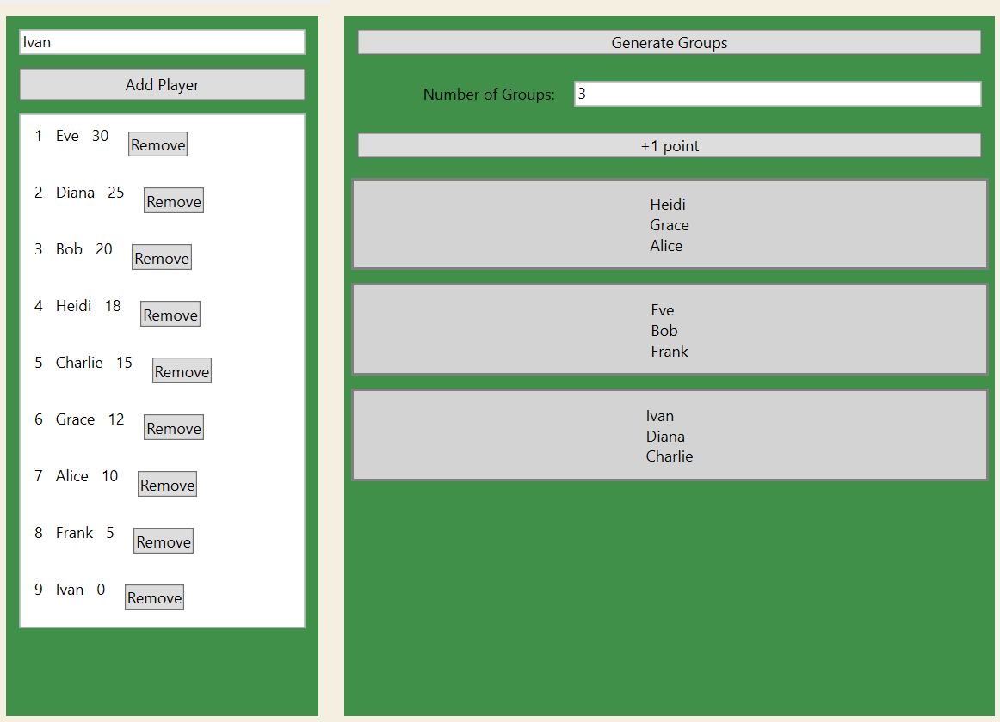

# PGC

PGC is a small program written in C# using WPF.
I allows you to keep track of a score based ranking of players in random groups for local events. 

# How it works

The left side shows all players, sorted by score. 
The right side shows everything to do with the groups.

To add a player, type their name and click the "Add Player" button.

To generate groups, type the number of groups you want in the labeled input field and click the "Generate Groups" button.

The "+1 point" button will add 1 point to all players of the selected group.
